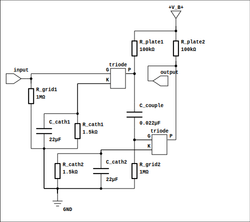
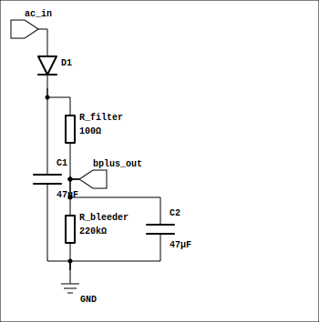
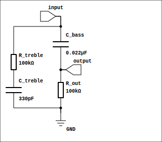

# danji — 胆机 (Vacuum Tube Amplifier)

[](#license)
[](https://www.rust-lang.org)

> A high-precision physically modeled vacuum tube amplifier simulation library

[中文](README.md)

**danji** (胆机, literally "tube machine" in Chinese) is a physically modeled vacuum tube amplifier simulation library written in Rust. It uses Modified Nodal Analysis (MNA) with Newton-Raphson iteration and Backward Euler integration for high-precision time-domain simulation of classic vacuum tube circuits.

Built-in physical models include triodes (Koren model), pentodes (Koren model + arctan knee correction), and diodes (Child-Langmuir law), along with passive components such as resistors, capacitors, inductors, and coupled inductors (output transformers).

---

## Features

- **Physically accurate tube models** — 9 triode types, 5 pentode types, 4 rectifier diodes
- **MNA solver** — Sparse Gaussian elimination + Newton-Raphson iteration with line search and divergence protection
- **Three deployment modes** — Core Rust library, offline CLI (WAV processing), real-time audio daemon + GUI controller
- **Runtime parameter adjustment** — B+ voltage, gain, and mix ratio adjustable during simulation
- **Push-pull support** — Dual-path processing via `process_sample_dual` API

---

## Circuit Topology

### single — Single Common-Cathode Stage

<p align="center">
  
</p>

### two-stage — Two-Stage RC-Coupled Cascade

<p align="center">
  
</p>

### chain — Full Preamplifier Chain

5AR4 rectifier PSU → 2× 12AX7 common-cathode stages → RC tone control (~4.8kHz treble / ~72Hz bass).

**Power Supply Module** (5AR4 + CRC π-filter):

<p align="center">
  
</p>

**Tone Control Module** (treble cut + bass cut):

<p align="center">
  
</p>

---

## Crate Architecture

```
danji (lib)          ← Core simulation engine
├── danji-cli        ← Offline WAV file processor
├── danji-realtime   ← Real-time audio daemon (BlackHole + CPAL)
└── danji-ctrl       ← Desktop GUI controller (egui)
```

| Crate | Purpose |
|-------|---------|
| `danji` | Core library: circuit modeling, MNA solver, tube physical models |
| `danji-cli` | CLI tool: reads WAV, processes through simulation, writes output |
| `danji-realtime` | macOS real-time audio daemon, controllable via Unix socket |
| `danji-ctrl` | egui-based desktop controller for the real-time daemon |

---

## Quick Start

```bash
# Build everything
cargo build --release

# Process a WAV file via CLI
cargo run --release --bin danji-cli -- input.wav -o output.wav --model two-stage

# Run real-time daemon (requires BlackHole)
cargo run --release --bin danji-realtime -- --device "$(danji-realtime --list-devices | grep BlackHole)"

# Run GUI controller
cargo run --release --bin danji-ctrl
```

### Built-in CLI Models

| Model | Description |
|-------|-------------|
| `single` | Single 12AX7 common-cathode stage (~62× gain) |
| `two-stage` | Two cascaded 12AX7 stages with RC coupling (~9022× gain) |
| `chain` | Full preamp chain: 5AR4 PSU → 2× 12AX7 → tone control |

---

## Code Example

Using danji as a library in your Rust project:

```rust
use danji::{SimConfig, Element};

fn main() -> Result<(), danji::DanjiError> {
    let mut sim = SimConfig::default()
        .sample_rate(48000.0)
        .bplus(250.0)
        .add_element(Element::Resistor { id: "R1", node_a: 0, node_b: 1, value: 100_000.0 })
        .add_element(Element::Resistor { id: "R2", node_a: 1, node_b: 0, value: 1_500.0 })
        .add_element(Element::Triode {
            id: "V1", plate: 1, grid: 2, cathode: 0, tube_type: "12AX7",
        })
        .build()?;

    let input = 0.1;
    let output = sim.process_sample(input)?;
    println!("{:?}", output);
    Ok(())
}
```

For detailed API reference, see [DESIGN.md](DESIGN.md).

---

## Supported Tubes

### Triodes (Koren model)

| Type | Typical Application |
|------|-------------------|
| 12AX7 | Preamp |
| 12AU7 | Cathode follower |
| 12AT7 | Phase splitter |
| 6DJ8 | Low-noise preamp |
| 6L6GC | Power stage |
| 6550 | Power stage |
| EL34 | Power stage |
| KT88 | Power stage |
| 6V6 | Power stage |

### Pentodes (Koren model + arctan knee correction)

| Type | Typical Application |
|------|-------------------|
| EL84 | Power stage |
| EL34 | Power stage |
| 6L6GC | Power stage |
| 6550 | Power stage |
| KT88 | Power stage |

### Diodes (Child-Langmuir law)

| Type | Typical Application |
|------|-------------------|
| 5AR4 | Full-wave rectifier |
| 5U4G | Full-wave rectifier |
| 6X4 | Half-wave rectifier |
| EZ81 | Half-wave rectifier |
| Silicon diode | General purpose |

---

## Directory Structure

```
├── Cargo.toml          # Workspace root
├── src/                # Core library
│   ├── circuit/        # Circuit modeling (nodes, elements, MNA solver)
│   ├── tube/           # Tube physical models
│   ├── simulator.rs    # Simulator / SimConfig builder
│   └── lib.rs
├── danji-cli/          # CLI tool
├── danji-realtime/     # Real-time daemon
├── danji-ctrl/         # GUI controller
├── examples/           # 12 example programs
├── test/               # Harmonic distortion test framework (Python + Typst)
└── devlog/             # Developer logs
```

---

## Performance

The core library is currently CPU single-threaded. Benchmarked on M3 MacBook Pro:

| Sample Rate | Single-stage Performance |
|-------------|------------------------|
| 44.1 kHz    | >15× real-time |
| 96 kHz      | >8× real-time  |
| 192 kHz     | >4× real-time  |

GPU acceleration (wgpu) interfaces are reserved as a future option.

------

## License

Licensed under **MIT OR Apache-2.0** (dual-licensed).
