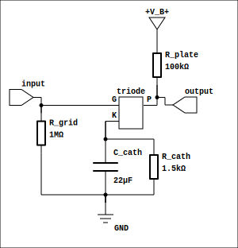

# danji — 胆机

[](#许可)
[](https://www.rust-lang.org)

> 高精度物理建模真空管放大器仿真库

[English](README.en.md)

**danji**（胆机）是一个基于物理建模的真空管放大器仿真库，使用 Rust 编写。核心采用改进节点分析法（MNA）结合牛顿-拉夫森迭代与后向欧拉积分，对经典真空管电路进行高精度时域仿真。

内置三极管（Koren 模型）、五极管（Koren 模型 + arctan 膝修正）和二极管（Child-Langmuir 定律）的物理模型，支持电阻、电容、电感以及耦合电感（输出变压器）等无源元件。

---

## 功能特性

- **物理精确的电子管模型** — 支持 9 种三极管、5 种五极管、4 种整流二极管
- **MNA 求解器** — 稀疏矩阵高斯消元 + Newton-Raphson 迭代，带线搜索与发散保护
- **三种使用方式** — 核心库（Rust crate）、离线 CLI（WAV 处理）、实时音频守护进程 + GUI 控制器
- **运行时参数调节** — 可在仿真过程中动态调整 B+ 电压、增益、混合比例
- **推挽架构支持** — 通过 `process_sample_dual` 接口支持双路差分处理

---

## 电路拓扑

单级共阴放大级（12AX7）：

<p align="center">
  
</p>

---

## Crate 架构

```
danji (lib)          ← 核心仿真引擎
├── danji-cli        ← 离线 WAV 文件处理器
├── danji-realtime   ← 实时音频守护进程 (BlackHole + CPAL)
└── danji-ctrl       ← 桌面 GUI 控制器 (egui)
```

| Crate | 用途 |
|-------|------|
| `danji` | 核心库：电路建模、MNA 求解、电子管物理模型 |
| `danji-cli` | 命令行工具，读取 WAV 文件经仿真后输出 |
| `danji-realtime` | macOS 实时音频处理守护进程，通过 Unix Socket 远程控制 |
| `danji-ctrl` | 基于 egui 的桌面控制器，连接守护进程进行参数调整 |

---

## 快速开始

```bash
# 构建全部
cargo build --release

# 运行 CLI：处理 WAV 文件
cargo run --release --bin danji-cli -- input.wav -o output.wav --model two-stage

# 运行实时守护进程（需安装 BlackHole）
cargo run --release --bin danji-realtime -- --device "$(danji-realtime --list-devices | grep BlackHole)"

# 运行 GUI 控制器
cargo run --release --bin danji-ctrl
```

### 内置 CLI 模型

| 模型 | 说明 |
|------|------|
| `single` | 单级 12AX7 共阴放大级（~62× 增益） |
| `two-stage` | 两级 12AX7 RC 耦合级联（~9022× 增益） |
| `chain` | 完整前级链路：5AR4 电源 → 2× 12AX7 → 音调控制 |

---

## 代码示例

在 Rust 项目中使用 danji 库：

```rust
use danji::{SimConfig, Element};

fn main() -> Result<(), danji::DanjiError> {
    let mut sim = SimConfig::default()
        .sample_rate(48000.0)
        .bplus(250.0)
        .add_element(Element::Resistor { id: "R1", node_a: 0, node_b: 1, value: 100_000.0 })
        .add_element(Element::Resistor { id: "R2", node_a: 1, node_b: 0, value: 1_500.0 })
        .add_element(Element::Triode {
            id: "V1", plate: 1, grid: 2, cathode: 0, tube_type: "12AX7",
        })
        .build()?;

    let input = 0.1; // 输入信号
    let output = sim.process_sample(input)?;
    println!("{:?}", output);
    Ok(())
}
```

详细 API 文档见 [DESIGN.md](DESIGN.md)。

---

## 支持的电子管

### 三极管（Koren 模型）

| 型号 | 典型应用 |
|------|----------|
| 12AX7 | 前置放大 |
| 12AU7 | 阴极跟随器 |
| 12AT7 | 相位倒相 |
| 6DJ8 | 低噪声前置 |
| 6L6GC | 功率级 |
| 6550 | 功率级 |
| EL34 | 功率级 |
| KT88 | 功率级 |
| 6V6 | 功率级 |

### 五极管（Koren 模型 + arctan 膝修正）

| 型号 | 典型应用 |
|------|----------|
| EL84 | 功率级 |
| EL34 | 功率级 |
| 6L6GC | 功率级 |
| 6550 | 功率级 |
| KT88 | 功率级 |

### 二极管（Child-Langmuir 定律）

| 型号 | 典型应用 |
|------|----------|
| 5AR4 | 全波整流 |
| 5U4G | 全波整流 |
| 6X4 | 半波整流 |
| EZ81 | 半波整流 |
| 硅二极管 | 通用 |

---

## 目录结构

```
├── Cargo.toml          # 工作空间根
├── src/                # 核心库
│   ├── circuit/        # 电路建模（节点、元件、MNA 求解器）
│   ├── tube/           # 电子管物理模型
│   ├── simulator.rs    # Simulator / SimConfig 构建器
│   └── lib.rs
├── danji-cli/          # CLI 工具
├── danji-realtime/     # 实时守护进程
├── danji-ctrl/         # GUI 控制器
├── examples/           # 12 个示例程序
├── test/               # 谐波失真测试框架 (Python + Typst)
└── devlog/             # 开发日志
```

---

## 性能

核心库当前为 CPU 单线程实现。在 M3 MacBook Pro 上：

| 采样率 | 单管仿真性能 |
|--------|-------------|
| 44.1 kHz | >15× 实时 |
| 96 kHz   | >8× 实时  |
| 192 kHz  | >4× 实时  |

GPU 加速（wgpu）已预留接口，目前 CPU 性能已满足需求。

------

## 许可

本项目采用 **MIT OR Apache-2.0** 双许可证。
